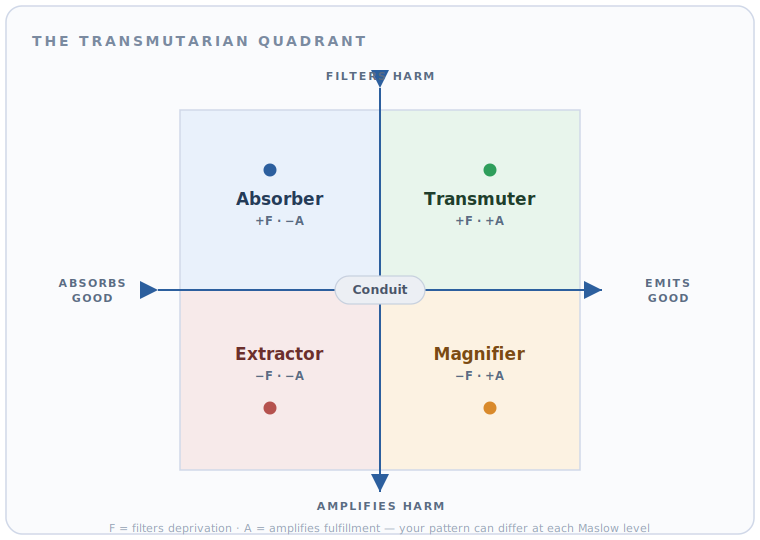

# The Transmutation Engine

**A conversational AI that helps you see — and grow — the invisible relational work you do every day: the harm you filter out, and the good you pass on.**

> _Economies measure throughput. They do not measure **transmutation**._
> — [transmutarianism.org](https://transmutarianism.org/)

The Transmutation Engine is the open-source reference implementation of **[transmutarianism](https://transmutarianism.org/)** — a framework for measuring the relational work that conventional metrics ignore: care, harm, safety, and dignity flowing between people. It's a warm, guided, chat-based assessment that maps how you handle the suffering and the joy that move through your life, then coaches you toward becoming someone who **breaks cycles of harm and creates more good than they receive**.

It runs locally. You bring your own LLM key. Your data stays in a single SQLite file on your machine.

<p align="center">
  
</p>

---

## Why this exists

The people who quietly hold the world together rarely show up in any ledger. The abuse survivor who raises their kids with tenderness instead of repeating the pattern. The coworker who absorbs a room's panic so others can think. The neighbor who makes a place feel safe. This is real, demanding work — and economics renders it invisible.

Transmutarianism gives that work a vocabulary and a measure. The Transmutation Engine turns the framework into something you can actually *do*: a personal assessment that meets you where you are, reflects your patterns back without judgment, teaches you the model through your own data, and helps you practice change over time.

It is **not** therapy, and it doesn't pretend to be. It's a mirror with a map.

---

## The model in 60 seconds

Two kinds of "flow" move between people:

| Flow | Symbol | What it is |
|------|--------|------------|
| **Fulfillment** | D+ | Joy, care, support, flourishing — needs being met |
| **Deprivation** | D− | Suffering, harm, neglect, trauma — needs going unmet |

You do two things with those flows — and how you do them defines your pattern:

- **Filtering (F)** — reducing deprivation by *absorbing more harm than you emit*. Positive F means you break cycles.
- **Amplification (A)** — generating fulfillment by *emitting more good than you absorb*. Positive A means you create more than you take.

Plot those on two axes — *how you handle harm* (Filter ↔ Amplify) and *how you handle good* (Absorb ↔ Emit) — and you land in one of **five archetypes**:

| Archetype | Pattern | In plain terms |
|-----------|---------|----------------|
| 🌟 **Transmuter** | +F, +A | Filters harm **and** amplifies good. Breaks cycles, creates flourishing. |
| 🛡️ **Absorber** | +F, −A | Takes on others' pain, but keeps joy private. |
| 📣 **Magnifier** | −F, +A | High energy — spreads everything, harm and good alike. |
| 🪣 **Extractor** | −F, −A | Passes harm along, keeps the good for themselves. |
| ➡️ **Conduit** | F≈0, A≈0 | Passes things through unchanged — the neutral baseline. |

These are **operating patterns, not identities**. You might be a Transmuter with your friends and an Absorber at work — at different [Maslow](https://en.wikipedia.org/wiki/Maslow%27s_hierarchy_of_needs) need levels. The assessment measures all of it across **8 dimensions**: one **transmutation-capacity** dimension — your actual Filtering and Amplification, built from four flow sub-dimensions (Deprivation Filtering, Fulfillment Emission, Absorption Patterns, Amplification Awareness) — plus **7 awareness prerequisites** (emotional awareness & regulation, self-compassion, reflective functioning, relational compassion, mindful presence, meta-cognitive and systemic/temporal awareness) that shape how much you're able to transmute in the first place.

---

## How the experience works

The Engine guides you through a complete lifecycle as a single, continuous conversation. A results panel beside the chat updates live as you go.

```
orientation → assessment → profile → education → development → reassessment → graduation → check-in
```

| Phase | What happens |
|-------|--------------|
| **Orientation** | A warm welcome and one grounding question: *what brought you here?* |
| **Assessment** | A **tiered, adaptive** mix of Likert questions and real-world scenarios. Everyone answers a shared core; the assessment then deepens only on the dimensions where your signal is unclear — so a clear pattern means fewer questions. Your archetype can surface **early**, before you finish. |
| **Profile** | Your responses are scored and you meet your archetype — on the quadrant chart above, alongside a radar chart of all 8 dimensions. |
| **Education** | The Engine teaches you the model *through your own results*, with comprehension checks — and captures every explanation into a **learning journal** you can reopen and review anytime. |
| **Development** | Personalized practices, a journal, and a roadmap for growth. |
| **Reassessment** | Targeted re-measurement to see what's shifted, gated on genuine readiness. |
| **Graduation** | A closing sequence and a profile snapshot artifact to keep. |
| **Check-in** | Come back anytime to re-measure and reflect. |

Scoring is **deterministic** (pure functions in [`scoring_engine.py`](agents/transmutation/scoring_engine.py) — no AI in the math). The LLM's job is to *interpret, teach, and coach* — never to invent your numbers.

### The assessment adapts to you

The v2 assessment is **tiered and screener-first**, so you answer only as many questions as your pattern actually requires:

- **A shared core, always.** Everyone answers the transmutation-capacity items and a set of real-world scenarios (these are what place you on the quadrant), plus the core awareness items and the *screener* questions that open each deep-dive dimension.
- **Deeper only where it's unclear.** A pure [`adaptive_engine.py`](agents/transmutation/adaptive_engine.py) reads your screener answers and expands a dimension into its full item set **only** when the signal is low, borderline, or inconsistent — a clear signal skips the extra questions entirely. No AI in that decision, either.
- **An early result you can trust.** Because your archetype comes from the transmutation-capacity items and scenarios, the Engine surfaces your quadrant placement **early** — before you finish the awareness deep-dive — with a **confidence band** that firms from low → high as you answer more.
- **Answers you can revise.** Change an earlier Likert or scenario answer — even after a reload, or from your session history — and any transmute-relevant edit re-scores the result live.

### Built-in safety, by design

Conversations about harm and need can surface real distress. The Engine runs a three-tier mental-health safety protocol with a strict **no-shame** posture. On any signal of crisis it stops the assessment, surfaces the **988 Suicide & Crisis Lifeline** and **Crisis Text Line**, and logs the concern — it never tries to play therapist. See [`prompts/shared/safety.py`](agents/transmutation/prompts/shared/safety.py).

---

## Quickstart

You'll need an API key for one LLM provider (Anthropic, OpenAI, AWS Bedrock, or a local Ollama model).

### Option A — Docker (recommended)

```bash
git clone https://github.com/Waterbear-AI/transmute.git
cd transmute

cp .env.example .env          # then add your provider's API key
make docker-up                # builds and starts the stack
```

Open **http://localhost:54718**. Register a local account and start talking.

### Option B — Local Python

```bash
python3 -m venv .venv && source .venv/bin/activate
pip install -r requirements.txt

cp .env.example .env          # add your API key
python main.py                # serves on http://localhost:54718
```

The SQLite database and schema are created automatically on first launch.

### Configuration

Model choice lives in [`config.yaml`](config.yaml); secrets live in `.env`. To switch providers, set the `provider`, `model_id`, and `api_key_env` fields:

```yaml
model:
  provider: anthropic                    # anthropic | openai | bedrock | ollama
  model_id: claude-sonnet-4-5-20250514
  api_key_env: ANTHROPIC_API_KEY         # name of the env var holding your key
```

Token usage and cost are tracked per call against the `model_costs` table in the same file, so you always know what a session cost.

---

## Architecture

A FastAPI monolith with a clean separation between the deterministic core, the agent layer, and a dependency-free frontend.

```
┌─────────────────────────────────────────────────────────────┐
│  Frontend  (vanilla JS, no build step)                       │
│  chat window  +  live results panel  +  quadrant chart        │
└───────────────┬─────────────────────────────────────────────┘
                │  REST + Server-Sent Events (streaming)
┌───────────────▼─────────────────────────────────────────────┐
│  FastAPI  (main.py)                                          │
│  auth · chat · assessment · results · sessions · usage · export│
└───────────────┬───────────────────────────┬─────────────────┘
                │                           │
┌───────────────▼──────────────┐  ┌─────────▼──────────────────┐
│  Agent layer  (Google ADK)   │  │  Deterministic core         │
│  root orchestrator routes to │  │  scoring_engine · flow_engine│
│  7 sub-agents by phase       │  │  adaptive_engine · sentinel  │
│  + LiteLLM provider adapter  │  │  pure functions, fully tested│
└───────────────┬──────────────┘  └─────────┬──────────────────┘
                └──────────────┬─────────────┘
                ┌──────────────▼──────────────┐
                │  SQLite  (single-file DB)    │
                │  versioned SQL migrations    │
                └──────────────────────────────┘
```

**Stack:** Python 3.13 · [FastAPI](https://fastapi.tiangolo.com/) · [Google ADK](https://github.com/google/adk-python) agents · [LiteLLM](https://github.com/BerriAI/litellm) (multi-provider) · Pydantic · SQLite · matplotlib (server-rendered dimension radar charts) · vanilla JS frontend with a client-side `<canvas>` quadrant chart (no framework, no bundler).

**Design notes worth knowing:**

- **The scoring is pure.** `scoring_engine.py` and `flow_engine.py` take responses in and return scores out — no database, no network, no AI. That's what makes the math auditable and the tests fast.
- **The assessment adapts, deterministically.** `adaptive_engine.py` decides when to deepen a dimension purely from your screener answers (low, borderline, or inconsistent signal expands it; a clear signal skips it). Like the scoring, that routing is a pure function with no AI in the loop.
- **One root agent, seven specialists.** The [root orchestrator](agents/transmutation/agent.py) handles orientation itself and transfers to a sub-agent per phase using ADK's built-in agent transfer.
- **Provider-agnostic.** Swap Anthropic for OpenAI, Bedrock, or a local Ollama model by editing one YAML block — the LiteLLM adapter handles the rest.
- **Built to port.** The entire `agents/` directory is designed to lift cleanly into a larger multi-tenant platform later; only the auth and storage layers would be swapped.

### Project layout

```
transmute/
├── main.py                  # FastAPI app + router wiring + DB migrations on boot
├── config.yaml / config.py  # model provider, costs, transmutation constants
├── agents/transmutation/    # the agent — portable, self-contained
│   ├── agent.py             #   root orchestrator
│   ├── sub_agents/          #   assessment, profile, education, development, …
│   ├── prompts/             #   phase prompts + shared safety/concepts
│   ├── scoring_engine.py    #   deterministic scoring  ← no AI
│   ├── flow_engine.py       #   fulfillment/deprivation flow math
│   ├── adaptive_engine.py   #   pure screener-first routing  ← no AI
│   └── question_bank.py     #   tiered assessment questions & scenarios
├── api/                     # FastAPI routers (auth, chat, assessment, results…)
├── db/                      # SQLite access + versioned migrations
├── models/                  # Pydantic domain models
├── frontend/                # chat UI + results panel (no build step)
└── tests/                   # unit, integration, and Playwright e2e
```

---

## Development

The project ships a **cost-free test harness**: a scripted mock LLM lets you exercise the entire stack — including end-to-end Playwright runs — without spending a cent on real model calls.

```bash
# Fast-forward a fresh user to any phase with production-shaped data
make seed PHASE=development EMAIL=dev@example.com

# Run the server against a scripted mock scenario (no real LLM calls)
make mock-run TRANSMUTE_MOCK_SCENARIO=tests/harness/scenarios/education_session.json

# Full end-to-end harness: seed → mock server → Playwright → teardown
make test-harness TRANSMUTE_MOCK_SCENARIO=tests/harness/scenarios/education_session.json
```

```bash
pytest                       # Python unit + integration suite
cd tests/e2e && npx playwright test   # browser end-to-end suite
```

CI runs the unit, integration, and end-to-end suites on every pull request to `main` (see [`.github/workflows/e2e-tests.yml`](.github/workflows/e2e-tests.yml)).

---

## Roadmap & status

This is an early, actively developed MVP. The **tiered adaptive assessment** (with its early transmute result and editable answers), deterministic scoring, profile, the **education learning journal**, and development phases are working end-to-end; the reassessment → graduation → check-in lifecycle loop is the current focus. Designed from day one to run on a local network so a small group — a family, a team, a research cohort — can each have their own private session.

---

## Contributing

Contributions are welcome — whether that's code, assessment scenarios, prompt refinements, or framework critique. A good first step:

1. Read the [**Architecture**](#architecture) section above, then skim `agents/transmutation/` — the agent is self-contained, and the deterministic engines are the source of truth for how scoring and routing work.
2. Open an issue describing what you'd like to change or add.
3. Keep the deterministic core deterministic — scoring changes need tests.

Please be mindful that this project deals with sensitive emotional material. The **no-shame**, safety-first posture is non-negotiable in any user-facing change.

---

## License

Released under the **[MIT License](LICENSE)** — free and open source, **free forever**, which is a core goal of the project. Use it, fork it, build on it.

---

## Links

- 🌐 **Framework & mission:** [transmutarianism.org](https://transmutarianism.org/)
- 🏗️ **Built by:** [Waterbear AI](https://waterbearai.com/)

<p align="center"><em>The work of holding people up has always been real. Now it's measurable.</em></p>
